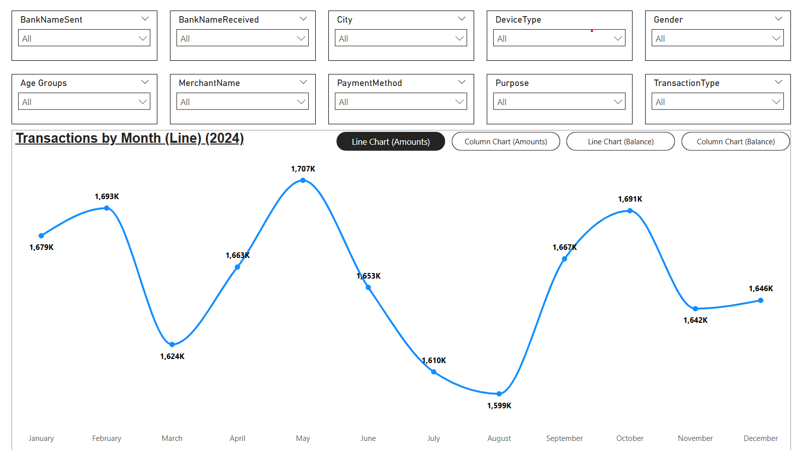
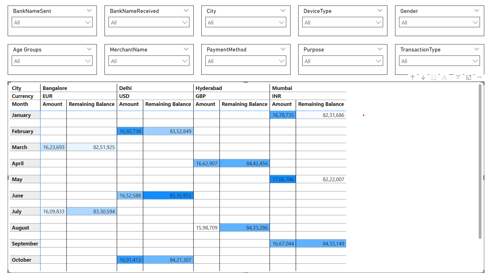

# UPI Transactions Dashboard – Power BI Project

This project showcases a comprehensive Power BI dashboard analyzing **Unified Payments Interface (UPI)** transactions across different cities, banks, age groups, and more.

## Dashboard Preview

### Transactions by Month 

#### Line Chart:

#### Column Chart:

### Remaining Balance by Month 

#### Line Chart:

#### Column Chart:

#### Line Chart:

### Matrix Visual

## Project Overview

The report provides insights into:
- Monthly UPI transaction volumes (January to October 2024)
- Remaining balances across cities
- Transactions by:
  - Bank (Sent and Received)
  - City
  - Device Type
  - Gender
  - Age Group
  - Merchant Name
  - Payment Method
  - Purpose
  - Transaction Type

## Data Summary

The dataset appears to include transactional data categorized by:
- **City**: Bangalore, Delhi, Hyderabad, Mumbai
- **Currency**: INR, EUR, USD, GBP
- **Time Period**: Jan – Oct 2024
- **Metrics**: `Amount`, `Remaining Balance`

Example (INR):
| Month     | Amount     | Remaining Balance |
|-----------|------------|-------------------|
| January   | 1,678,735  | 8,231,686         |
| February  | 1,692,738  | 8,352,849         |
| ...       | ...        | ...               |
| October   | 1,691,413  | 8,421,307         |

##  Key Visuals

The Power BI dashboard includes:

- **Line and Column Charts** for monthly UPI transaction trends
- **Slicers** for:
  - Bank Sent/Received
  - Device Type
  - Demographics (Gender, Age)
  - Merchant & City
  - Payment Method and Transaction Type
- **Filters** for:
  - Currency (INR, USD, EUR, GBP) to analyze transactions in different monetary units
- **Bookmarks Navigation**: Interactive bookmarks allow users to switch between different chart views (e.g., line vs. column charts), enhancing data exploration.
- **Synced Slicers Across Pages**: Slicers are synced across report pages to ensure consistent context and seamless navigation.

## 🎯 Purpose

To visualize and understand UPI transaction patterns and user behavior across various dimensions. Useful for:
- Financial analysts
- Business intelligence professionals
- Banks and fintech stakeholders
